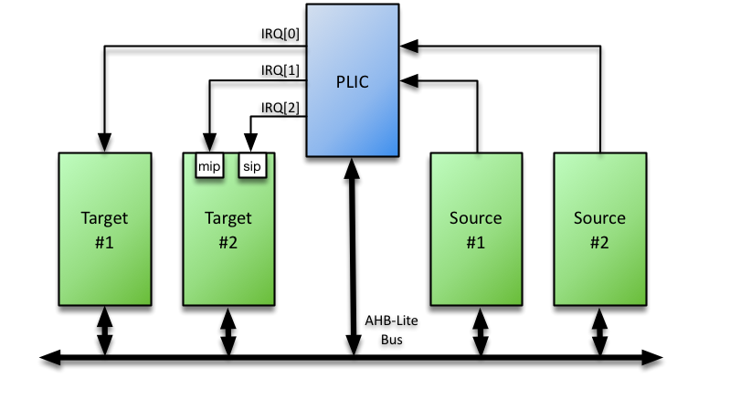

# AHB-Lite Platform-Level Interrupt Controller (PLIC)
## Overview

Fully Parameterized & Programmable Platform Level Interrupt Controller (PLIC) for RISC-V based Processor Systems supporting a user-defined number of interrupt sources and targets.

## Documentation

- [Datasheet](DATASHEET.md)
- [Register Map Worksheet](docs/assets/csv/RegisterMapping.xlsx)

## Features

- AHB-Lite Interface with programmable address and data width
- User defined number of Interrupt Sources & Targets
- User defined priority level per Interrupt Source
- Interrupt masking per target via Priority Threshold support
- User defined Interrupt Pending queue depth per source

## Compatibility

Compliant to the RISC-V Privilege Level 1.9, 1.9.1, 1.10 specifications

## Interfaces

- AHB3 Lite
- Dynamic Registers

The PLIC core implements Dynamic Registers, which means the registers and register mapping are automatically generated based on the parameters provided to the core. The core prints the register mapping during simulation (and for some tools during synthesis).

## License

Released under the RoaLogic [BSD License](/LICENSE.md)

## Dependencies
Requires the Roa Logic [AHB3Lite Package](). This is included as a submodule.
After cloning the git repository, perform a `git submodule init` to download the submodule.
